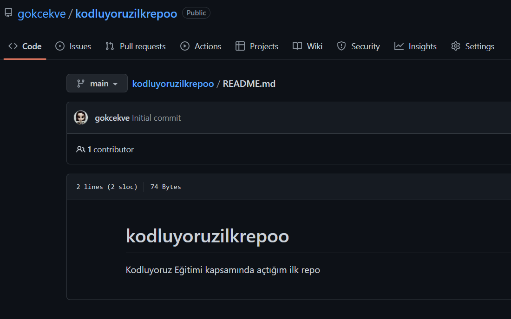

# Kodluyoruz Ilk Repo

Bu repo [Kodluyoruz](https://www.kodluyoruz.org) eğitiminde oluşturduğum ilk repo. İçerisinde bir adet README dosyası ve bir adet index.html bulunmaktadır.



## Installation

Öncelikle projeyi klonlayın:

`https://github.com/gokcekve/kodluyoruzilkrepoo.git`

## Usage

Projeyi klonladıktan sonra VSCode ile açtım. 
Windows için:
```linux
cd kodluyoruzilkrepo
code .
```

## Contributing
Pull request kabul edilir.

## License
[MIT](https://choosealicense.com/licenses/mit/)